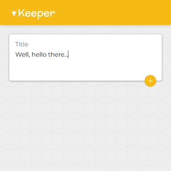

# London App Brewery - Keeper App

This is a solution to the [Keeper App](https://www.udemy.com/course/the-complete-web-development-bootcamp/learn/lecture/17038882) challenge on [Udemy](https://www.udemy.com/course/the-complete-web-development-bootcamp/).

## Table of contents

- [Overview](#overview)
  - [The challenge](#the-challenge)
  - [Screenshot](#screenshot)
  - [Links](#links)
- [My process](#my-process)
  - [Built with](#built-with)
  - [How to install and run](#how-to-install-and-run)
- [Author](#author)

## Overview

### The challenge

"Learn the basics of REACT by creating a Keeper app."

### Screenshot



### Links

- Code URL: [Github](https://github.com/cekstedt/LAB-Keeper-App)
- Live Site URL: [Netlify](https://magical-pavlova-f1563c.netlify.app/)
- Challenge URL: [Udemy](https://www.udemy.com/course/the-complete-web-development-bootcamp/learn/lecture/17038882)

## My process

### Built with

- React
- Material UI

### How to install and run

Make sure you have node.js installed.
```
node -v
```

Clone into the repo.
```
git clone https://github.com/cekstedt/LAB-Keeper-App
```

Navigate into the root project folder and install dependencies.
```
cd LAB-Keeper-App/
npm install
```

Lastly, run the command `npm run start` to start the development server, then navigate to http://localhost:3000/.  
To create a production build, use `npm run build`.

## Author

- [@cekstedt](https://github.com/cekstedt)